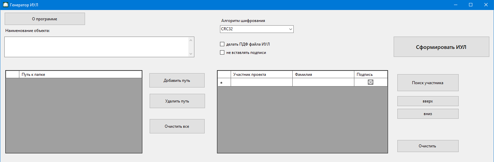

### Программа Генератор-ИУЛ
📌Программа Генератор-IUL предназначена для автоматизированного формирования информационно-удостоверяющих листов (ИУЛ) на основе PDF-файлов проектной документации, с возможностью добавления участников проекта и их подписей, экспорта в Word и PDF, а также вычисления хэш-сумм (CRC32, MD5).

***
1. ✅ Минимальные требования
•	Windows 10/11

•	Установленный Microsoft Word

•	.NET Framework 4.7.2+

•	Доступ к шаблону шаблон ИУЛ.docx (расположен рядом с программой)

•	Папка с PDF-документами

2. 📥 Подготовка

Убедитесь, что рядом с .exe-файлом находится:

•	шаблон ИУЛ.docx

•	participants.db (будет создан автоматически при первом запуске)

Запустите программу IUL.exe
***
***
🧾 Основные шаги работы
1. Укажите наименование объекта.
2. 🔽 Укажите путь к PDF-документам

•	Нажмите «Добавить»

•	Выберите папку, где находятся PDF-файлы

•	Повторите при необходимости (поддерживается несколько путей)

3. 👥 Выберите участников проекта

•	Нажмите «Выбрать участников»

•	Поставьте галочки напротив нужных ФИО

•	Нажмите «ОК»

•	Укажите роли участников (например, "ГИП", "Разработал", "Проверил")

✏️ Если база пуста — добавьте участников вручную через кнопку «Добавить участника» в форме выбора
Подписи необходимо сохранять в формате .png в размерах 100х100 px

4. 🧮 Выберите тип хэш-суммы

•	Выберите из выпадающего списка CRC32 или MD5

•	Программа автоматически рассчитает хэш для каждого PDF

🔢 CRC32

CRC32 (Cyclic Redundancy Check, 32-битный) — это не криптографический хэш, а контрольная сумма.
Её главная цель: обнаружение случайных ошибок при передаче/хранении данных.

Алгоритм (упрощённо):

Берётся исходный поток байтов.

Начальное значение регистра = 0xFFFFFFFF.

Каждый байт проходит через таблицу из 256 предвычисленных значений (CRC32 Table).

Регистр «сдвигается» и комбинируется с этим байтом через побитовые операции XOR.

В конце результат инвертируется (crc ^ 0xFFFFFFFF).

Итог — 32-битное целое (обычно записывают в 8 шестнадцатеричных символах).

👉 Главное: CRC32 вычисляется очень быстро, но не предназначен для защиты (можно легко подобрать коллизию).

🔐 MD5

MD5 (Message Digest Algorithm 5) — криптографический хэш, выдаёт 128-битное значение.

Алгоритм (упрощённо):

Данные разбиваются на блоки по 512 бит (64 байта).

Добавляется «хвост» (padding): сначала бит 1, потом нули, потом длина сообщения.

Каждый блок обрабатывается 64 итерациями с использованием нелинейных функций (F, G, H, I), побитовых сдвигов и сложений по модулю 2³².

Итоговое состояние — 4 регистра по 32 бита (A, B, C, D).

Конкатенация A+B+C+D = 128-битный хэш (обычно показывают как 32 hex-символа).

👉 MD5 считается сломленным (можно найти коллизии), но для проверки целостности файлов (без защиты от злоумышленников) всё ещё активно используют.

5. 🖊️ Подписи

•	Если нужно вставлять подписи в Word — оставьте галочку «Вставлять подписи»

•	Если галочка снята, подписи не вставляются

6. 📄 Формирование ИУЛ

•	Нажмите кнопку «Сформировать ИУЛ»

•	Программа создаст .docx для каждого PDF-документа

•	Если выбрана опция «Экспорт в PDF», создаётся также .pdf-версия

7. 💾 Сохранение

•	Файлы сохраняются в те же папки, где лежат PDF-документы

•	Имена файлов: ИмяФайла-ИУЛ.docx и ИмяФайла-ИУЛ.pdf

***
